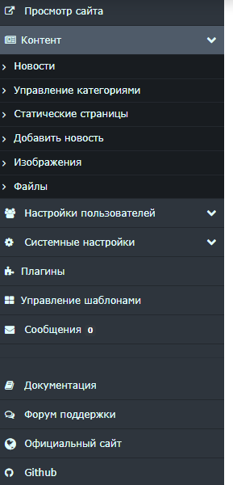
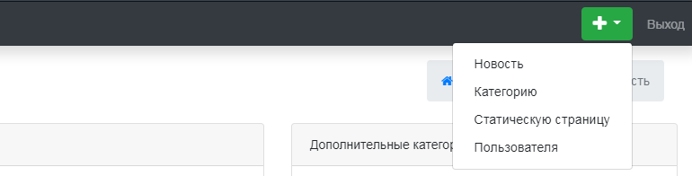

Основные компоненты управления "главная страница панели управления NGCMS"
=========================================================================

### Боковая информационная панель

Позволяет перейти на ваш сайт, здесь расположены ссылки на различные разделы админ-панели. (рис 1.3).

{.img-fluid}
рис 1.3

### Верхняя информационная панель

 Позволяет выйти из системы ,также там расположены ссылки на добавление новостей,статических страниц,пользователей,категорий. (рис 1.4).

{.img-fluid}
рис 1.4

© 2008-2020 Next Generation CMS
