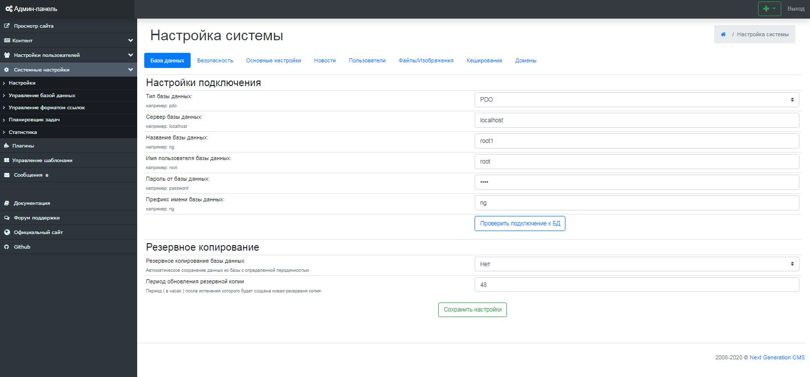

Настройки системы
=================

Все основные настройки CMS и вашего сайта сосредоточены в разделе "Настройки системы".
 Все настройки поделены на вкладки, в зависимости от их предназначения.
У каждой опции существует своё описание, которое поможет вам при внесении изменений. (рис 8.1).

{.img-fluid}
рис 8.1

© 2008-2020 Next Generation CMS
