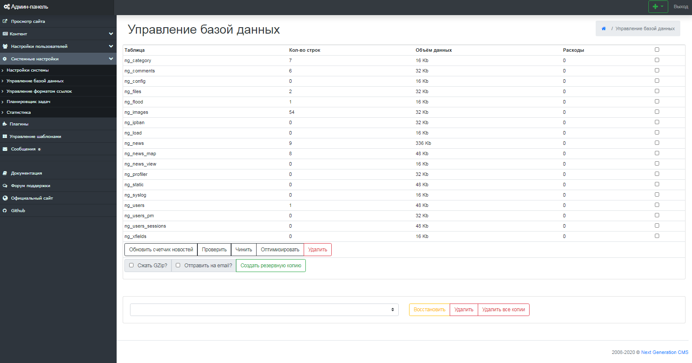
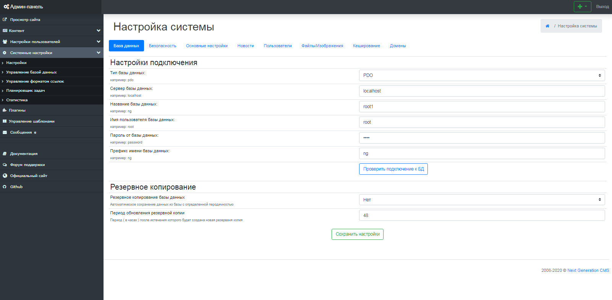

-   [Знакомство с системой]()
    -   [Основные сведения](about.html)
    -   [Вход в систему управления](enter.html)
    -   [Основные компоненты управления](components.html)
-   [Установка системы]()
    -   [Требования к хостингу](hosting.html)
    -   [Инсталляция](installation.html)
-   [Возможности NGCMS]()
    -   [Управление контентом]()
        -   [Новости](news.html)
        -   [Категории](catigories.html)
        -   [Статические страницы](static.html)
    -   [Настройки пользователей]()
        -   [Управление пользователями](users.html)
        -   [Блокировка IP-адресов](ipban.html)
    -   [Системные настройки]()
        -   [Настройки системы](config.html)
        -   [Управление базой данных](dbo.html)
        -   [Управление форматом ссылок](urls.html)
    -   [Дополнительные настройки]()
        -   [Управление плагинами](plugins.html)
        -   [Управление изображениями](images.html)
        -   [Управление файлами](files.html)
        -   [Управление шаблонами](templates.html)

Управление базой данных
=======================

Этот функционал предназначен для создания резервных копий базы данных, а также для различных других действий с таблицами базы. (рис 9.1).
 Например, в нижней части рабочей области содержится список существующих архивных копий. Каждую из них можно восстановить или удалить.

рис 9.1

Регламентное обслуживание всех таблиц БД
========================================

Выбираем команду "Проверить" по всем таблицам базы последовательно, если в результате этого запроса будет содержаться негативный результат, то запускается операция восстановления базы (команда "Чинить").
 После того как выполнена проверка таблицы, проводится ее оптимизация. (команда "Оптимизировать").

Автоматический бекап БД
=======================

В Next Generation CMS присутствует функция создания автоматического бекапа базы данных MySQL.
 Для создания бекапа в автоматическом режиме вам необходима поддержка вашим хостингом функции запуска приложений по расписанию (CRON).
 По умолчанию, в целях безопасности, автоматическая возможность создания резервных копий отключена. Как включить данную возможность показано на скриншоте ниже. (рис 9.2).

рис 9.2

Все резервные копии БД храняться в директории /engine/backups/

© 2008-2020 Next Generation CMS
