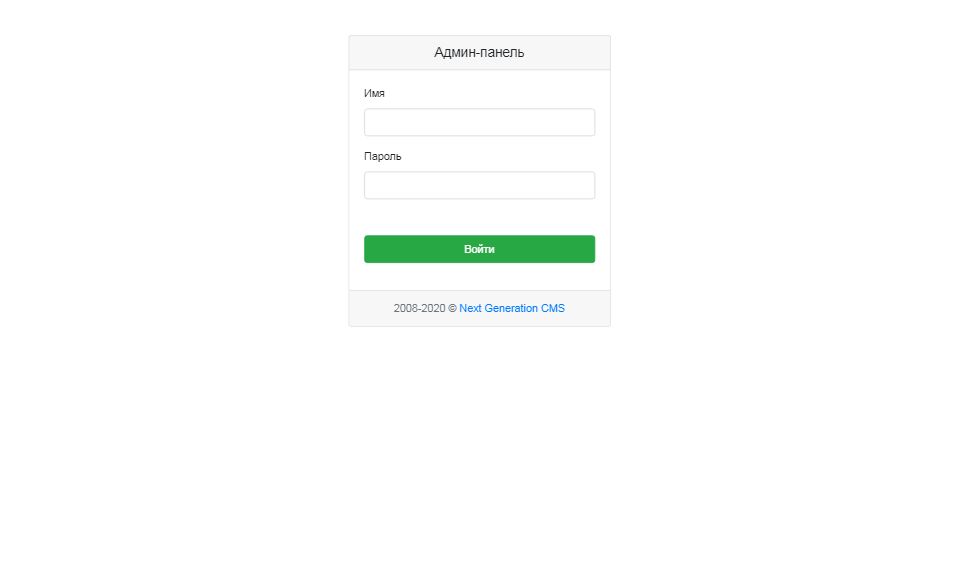
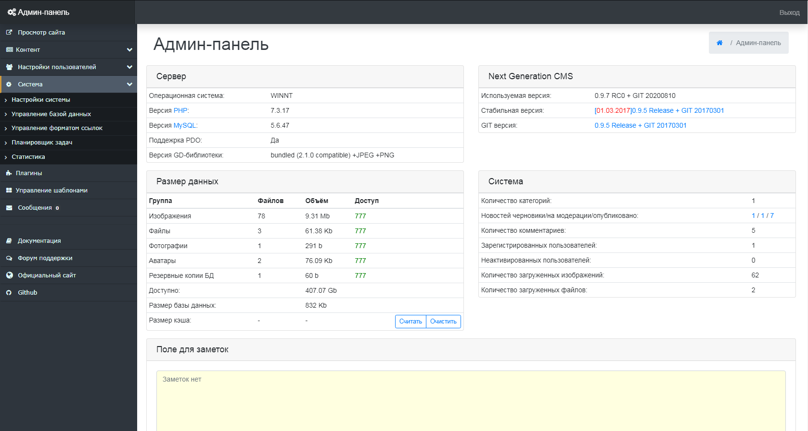

Вход в систему управления
=========================

Для доступа в систему управления вам необходимы адрес сайта (для определенности будем считать, что это http://mysite.com), а также пара логин/пароль. Эта пара задается при инсталляции системы.

Вход в систему управления осуществляется через один и тот же относительный адрес, добавляемый к имени сайта, и который выглядит как www.mysite.com/engine

Набрав данный адрес в адресной строке браузера, вы попадете на страницу авторизации, которая показана на рисунке 1.1

{.img-fluid}
рис 1.1

Процесс авторизации необходим для того, чтобы система вас узнала, и настроила рабочую область в соответствии с вашими правами доступа. Для авторизации в системе необходимо ввести логин и пароль в соответствующие поля, затем нажать на кнопку «Вход» или клавишу “Enter”.

В случае возникновения ошибки при вводе логина или пароля вы будете возвращены к экрану авторизации – система предложит вам исправить свою ошибку. Отказ в доступе может наступить, если администратор сайта отключил вашу учетную запись, либо запись не существует. В любом случае, если вы уверены, что логин и пароль вы ввели правильно, но система не впускает вас далее страницы авторизации, вам следует обратиться к администратору проекта за получением или разблокировки учетной записи пользователя.

Если данные доступа были введены верно (предполагается, что пользователь с такими логином/паролем существует в системе), вы попадете на основную страницу системы управления (рис 1.2).

{.img-fluid}
рис 1.2

© 2008-2020 Next Generation CMS
