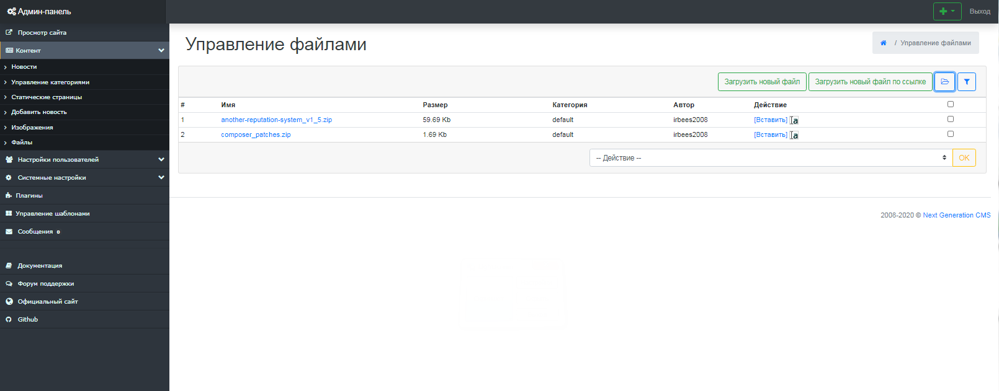
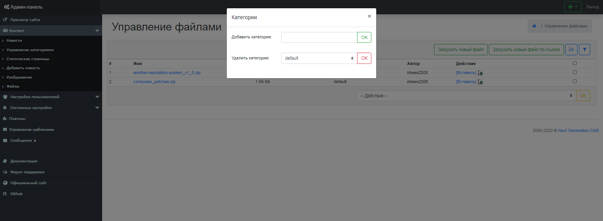
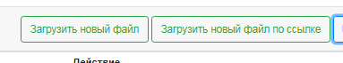

-   [Знакомство с системой]()
    -   [Основные сведения](about.md)
    -   [Вход в систему управления](enter.md)
    -   [Основные компоненты управления](components.md)
-   [Установка системы]()
    -   [Требования к хостингу](hosting.md)
    -   [Инсталляция](installation.md)
-   [Возможности NGCMS]()
    -   [Управление контентом]()
        -   [Новости](news.md)
        -   [Категории](catigories.md)
        -   [Статические страницы](static.md)
    -   [Настройки пользователей]()
        -   [Управление пользователями](users.md)
        -   [Блокировка IP-адресов](ipban.md)
    -   [Системные настройки]()
        -   [Настройки системы](config.md)
        -   [Управление базой данных](dbo.md)
        -   [Управление форматом ссылок](urls.md)
    -   [Дополнительные настройки]()
        -   [Управление плагинами](plugins.md)
        -   [Управление изображениями](images.md)
        -   [Управление файлами](files.md)
        -   [Управление шаблонами](templates.md)

Управление файлами
==================

Next Generation CMS позволяет выполнять различные операции над файлами, а также создавать хранилища файлов сложной структуры. (рис 13.1).

рис 13.1

Работа с категориями файлов
===========================

Компонент позволяет создавать неограниченное количество категорий одинарной вложенности. (рис 13.2).
 Для создания категории, нужно выбрать вкладку "Категории", ввести в поле вваода "Имя" название новой категории и нажать кнопку "Ок".
 В этой же вкладке осуществляется удаление категорий.

рис 13.2

Для удаления категории, сначала удалите все файлы, которые назодятся в данной категории.

Загрузка файлов
===============

Чтобы попасть в раздел загрузки файлов, выбирите вкладку "Загрузить файлы".
 Предусмотренно 2 различных варианта загрузки файлов - с компьютера и по ссылке. (рис 13.3).

рис 13.3

© 2008-2020 Next Generation CMS
