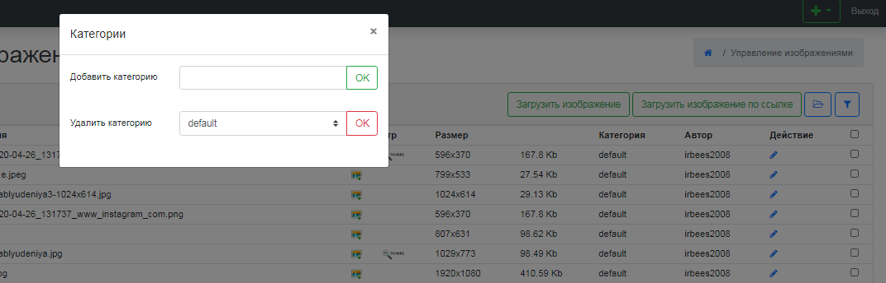
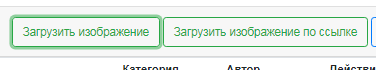
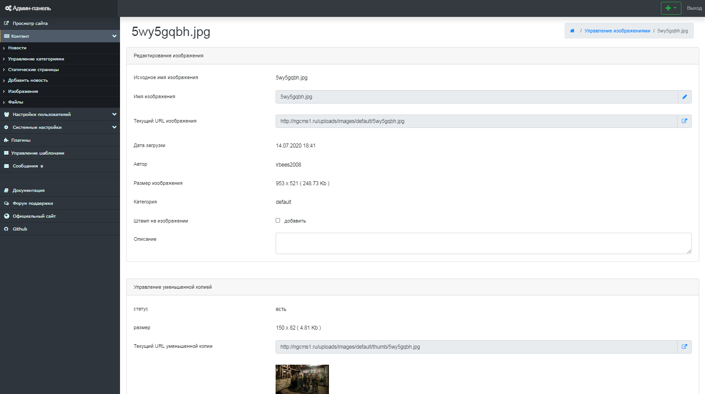

Управление изображениями
========================

Next Generation CMS позволяет выполнять различные операции над изображениями, а также создавать хранилища изображений. (рис 12.1).

{.img-fluid}
рис 12.1

Работа с категориями изображений
================================

Компонент позволяет создавать неограниченное количество категорий одинарной вложенности. (рис 12.2).
 Для создания категории, нужно выбрать вкладку "Категории", ввести в поле вваода "Имя" название новой категории и нажать кнопку "Ок".
 В этой же вкладке осуществляется удаление категорий.

{.img-fluid}
рис 12.2

Для удаления категории, сначала удалите все изображения, которые назодятся в данной категории.

Загрузка изображений
====================

Чтобы попасть в раздел загрузки файлов, выбирите вкладку "Загрузить изображения".
 Предусмотренно 2 различных варианта загрузки файлов - с компьютера и по ссылке. (рис 12.3).

{.img-fluid}
рис 12.3

Редактирование конкретного изображения
======================================

Компонент позволяет редактировать отдельно выбранные изображения.
 Основные возможности - редактирование названия, создание превью изображения с различными пааметрами, добавление описания к изображению. (рис 12.4).

{.img-fluid}
рис 12.4

© 2008-2020 Next Generation CMS
