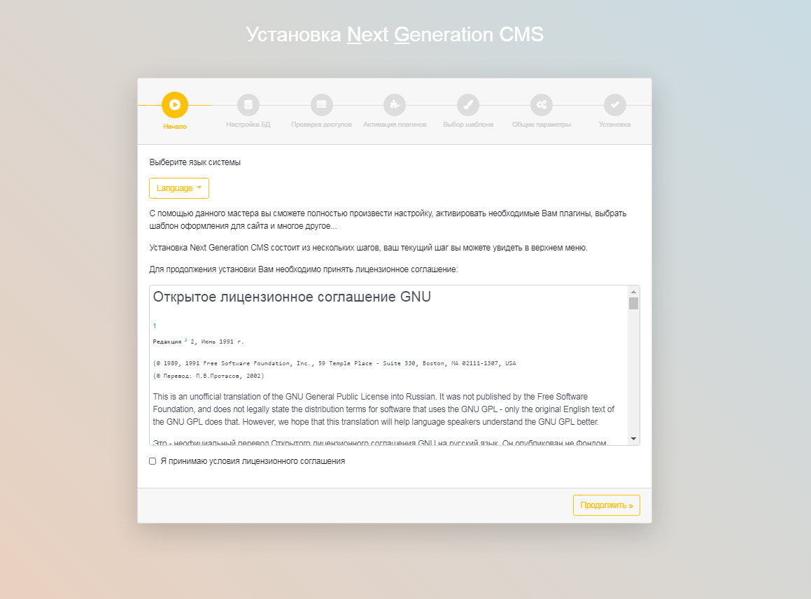
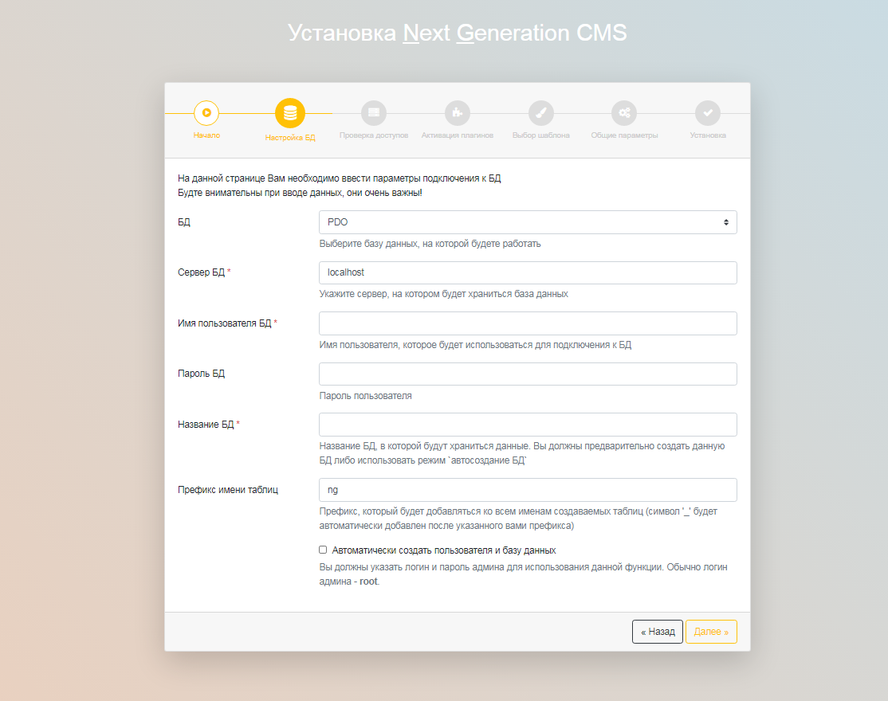
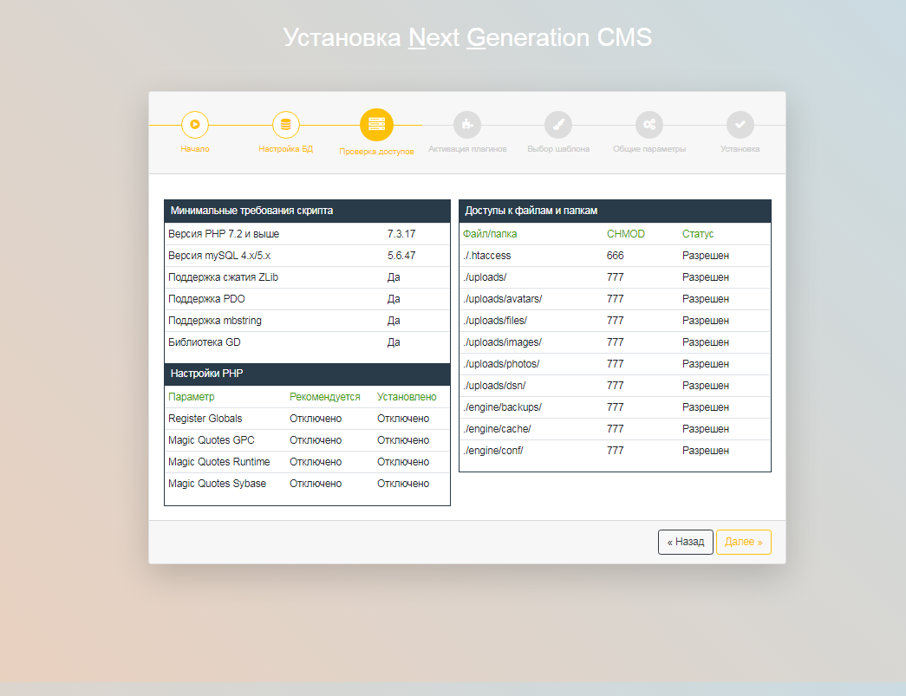
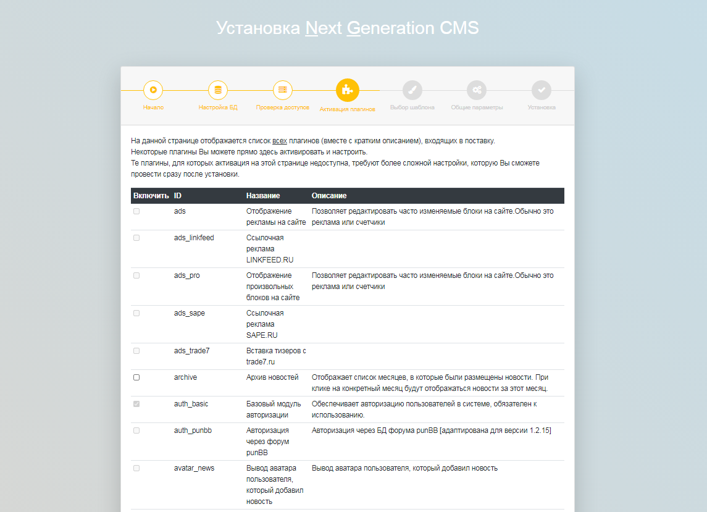
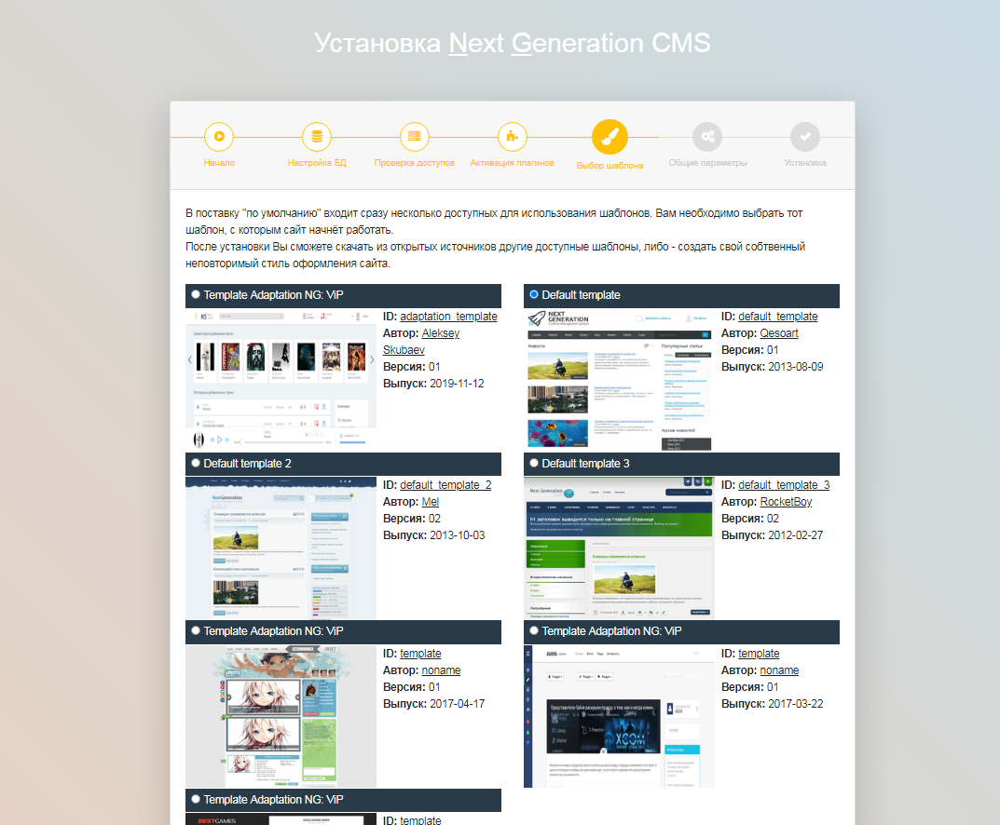
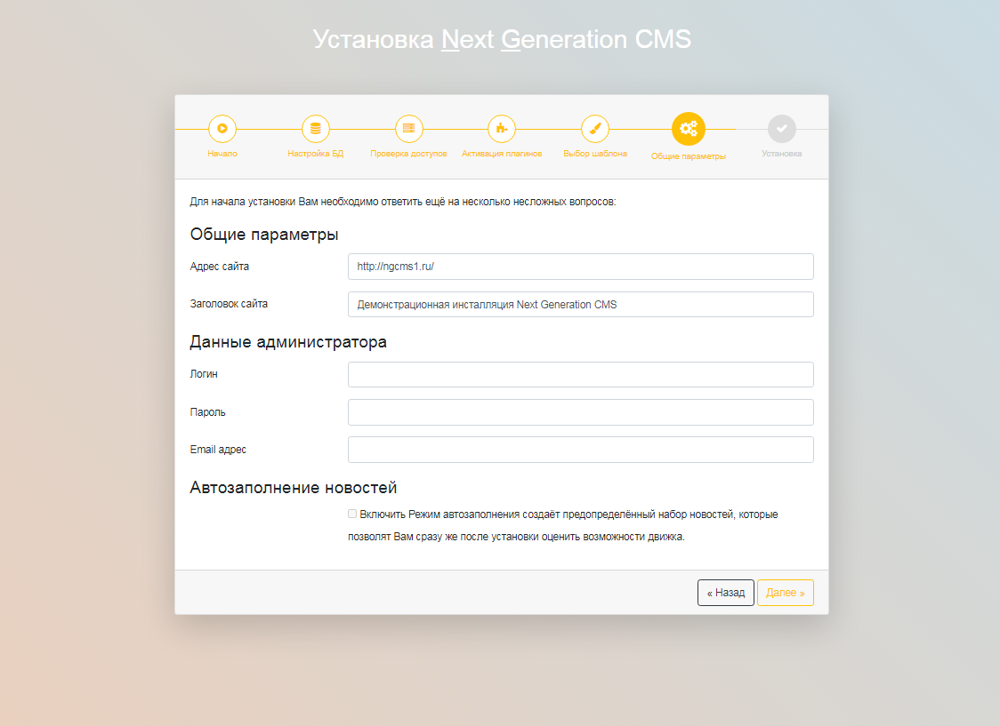
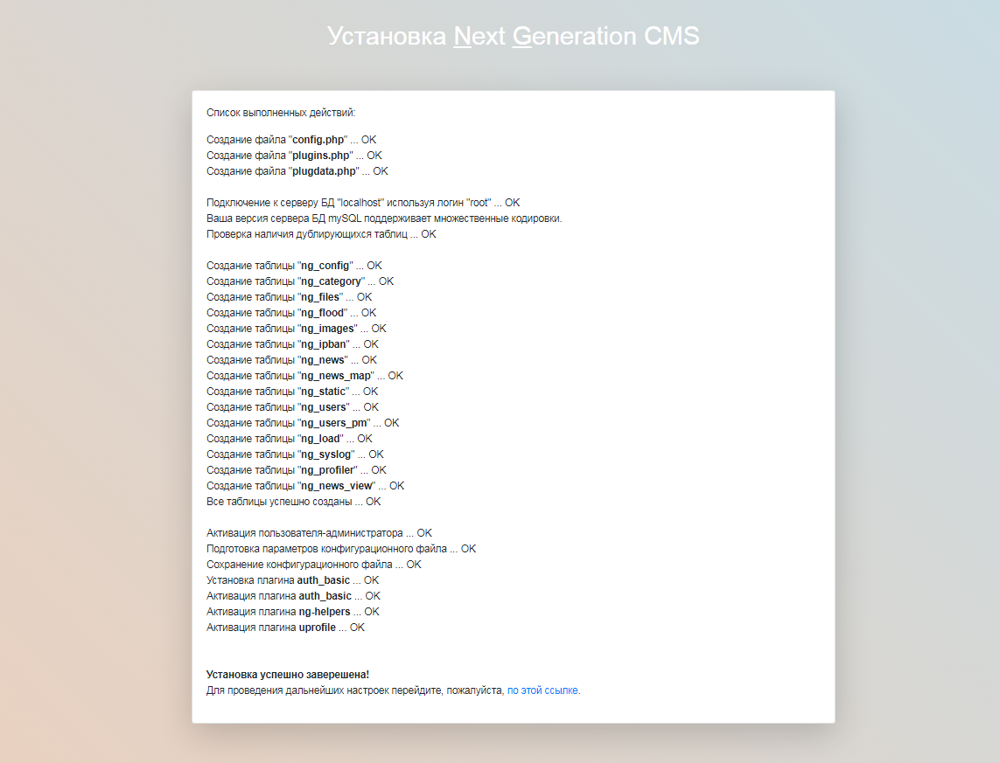

Инсталляция
===========

Подготовительный этап
---------------------

Перед установкой необходимо скачать последнюю версию NGCMS [с официального сайта](http://ngcms.ru/), либо с [GIT репозитория](https://github.com/vponomarev/ngcms-core).

-   Распакуйте архив с дистрибутивом во временный каталог.
-   Загрузите все файлы из временного каталога в корневой каталог вашего сайта.
-   Выставьте необходимые права доступа для следующих файлов/каталогов:
    -   папка: uploads/ (и все папки внутри)
    -   папка: templates/ (и все папки внутри)
    -   папка: engine/conf/ (и все файлы внутри)
    -   папка: engine/backups/
    -   папка: engine/cache/
    -   папка: engine/skin/default/tpl (и все папки внутри)
    -   все файлы (\*.tpl) во всех папках: templates/
-   Наберите в браузере адрес вашего сайта
-   Следуйте дальнейшим инструкциям

Установка системы
-----------------

Фактически установка системы состоит из 7 простых шагов, проядя которые вы полочите полностью рабочую CMS.

Шаг 1: Лицензионное соглашение

На данном шаге Вам нужно ознакомиться с лицензионным соглашением NGCMS и принять его, поставиь соответствующую галочку внизу страницы. (рис 2.1)

{.img-fluid}
рис 2.1

Шаг 2: Настройка БД

На данной странице Вам необходимо ввести параметры подключения к БД. (рис 2.2)

{.img-fluid}
рис 2.2

Шаг 3: Проверка доступов

На данном шаге выполняется проверка на соответствие характеристик сервера к минимальные требования скрипта. Также проверяется правильно ли выставлены права доступа (chmod) к директориями. (рис 2.3)

{.img-fluid}
рис 2.3

Шаг 4: Активация плагинов

На данной странице отображается список плагинов, входящих в поставку NGCMS. Некоторые из них вы можете активировать прямо здесь. (рис 2.4)

{.img-fluid}
рис 2.4

Шаг 5: Выбор шаблона

На данной странице вам предстоит выбрать шаблон для NGCMS. (рис 2.5)

{.img-fluid}
рис 2.5

Шаг 6: Общие параметры

На данном шаге требуется ввести общие параметры сайта, такие как URL сайта, заголовок, а также логин и пароль для администратора. (рис 2.6)

{.img-fluid}
рис 2.6

Шаг 7: Завершение установки

Это заключительный этап установки. Здесь отображаются все, выполненные во время установки, действия. (рис 2.7)

{.img-fluid}
рис 2.7

© 2008-2020 Next Generation CMS
