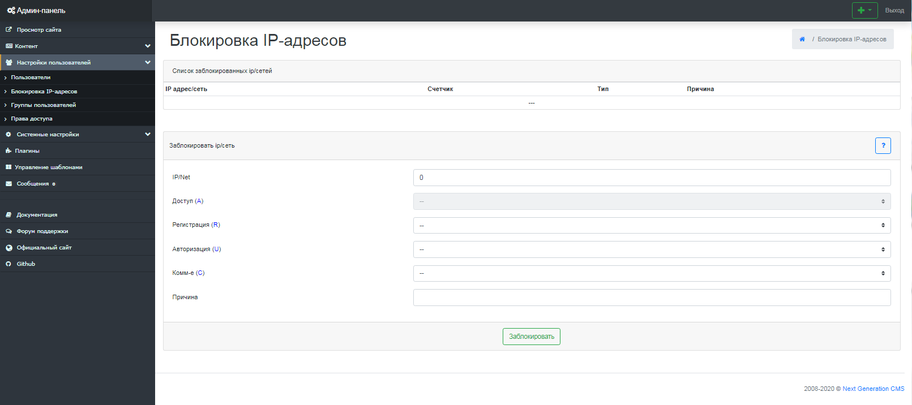

Блокировка IP-адресов
=====================

В системе есть возможность ограничить некоторых пользователей для определенных действий, такие как: регистрация, авторизация, комментирование. (рис 7.1).
 IP адрес/сеть необходимо указывать в виде xxx.xxx.xxx.xxx (адрес) либо xxx.xxx.xxx.xxx/xxx.xxx.xxx.xxx (сеть)

{.img-fluid}
рис 7.1

Здесь вы сможете лишить пользователя прав (выбрав "запрет" или "тихий запрет", и нажав «Заблокировать»).
 "Запрет" - блокировка пользователя, с указанием причины блокировки.
 "Тихий запрет" - пользователю вместо явной ошибки "доступ запрещен" выводится какая-либо другая системная ошибка движка.
 Может быть полезно для настырных, но не очень находчивых юзеров, которых надо заблокировать.

© 2008-2020 Next Generation CMS
