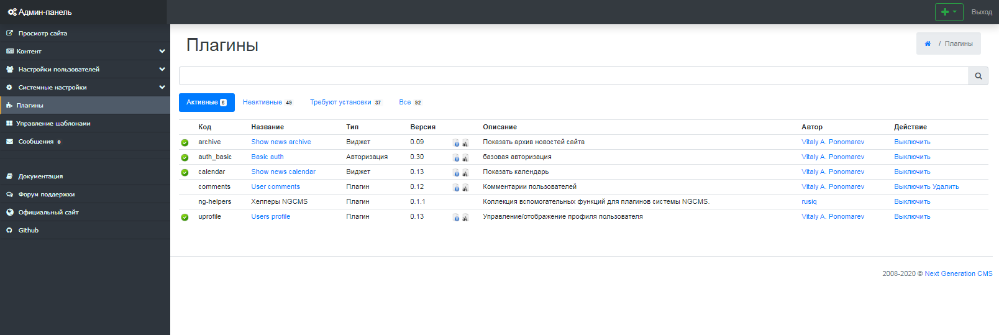

Управление плагинами
====================

Интерфейс управления плагинами состоит из 4 вкладок и 4 таблиц, в которых отображаются все плагины, которые могут быть установлены в Next Generation CMS. (рис 11.1).
 **Плагины могут находиться в 3 состояниях:**
 - Требуют установки (отмечены синим фоном).
 - Требуют активации (отмечены белым фоном и серым цветом текста).
 - Активированные (отмечены белым фоном и черным цветом текста).

{.img-fluid}
рис 11.1

Все плагины, предназначенные для установки и активации, должны находиться в директории /engine/plugins/

© 2008-2020 Next Generation CMS
