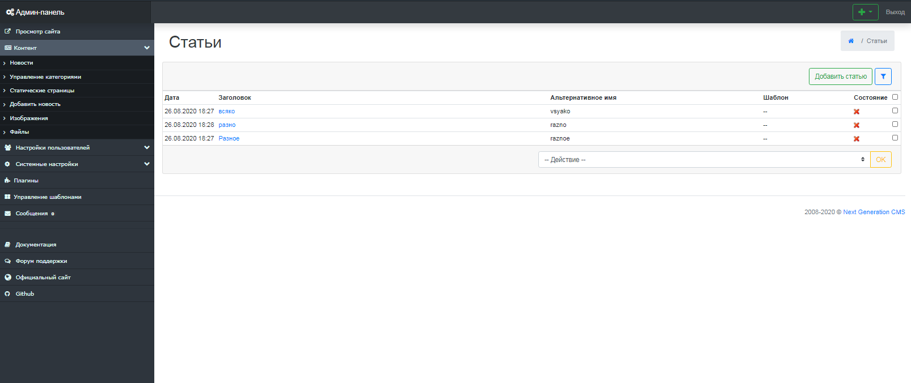
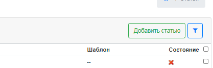
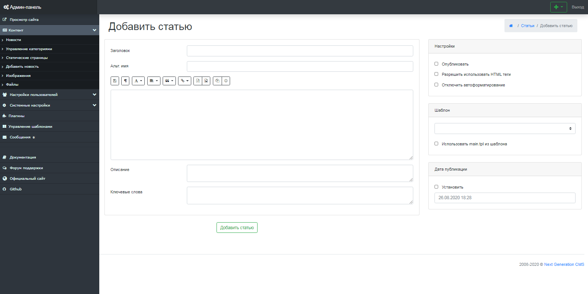

Работа со статическими страницами
=================================

Интерфейс управления статическими страницами состоит из одного цельного блока, на котором расположены различные элементы (рис 5.1).
 Фактически на этой странице отображена таблица со столбцами "Заголовок" и "Адрес страницы".
 Сверху расположено поле ввода, в котором вы можете указать, сколько статических страниц выводить в постраничной навигации.
 Также доступны 3 массовые операции над статическими странциами - удаление, публикация, снятие с публикации.

{.img-fluid}
рис 5.1

Добавление новой страницы
=========================

Для добавления новой страницы, нажмите на вкладку "Добавить статическую страницу" (рис 5.2).

{.img-fluid}
рис 5.2

После этого вы будете перенаплавлены на страницу с формой, которую вам потребуется заполнить. (рис 5.3).

{.img-fluid}
рис 5.3

**Внимание:** поле заголовок и само тело страницы являются обязательными к заполнению.

**Заголовок** - указывается название новой страницы. Данные заголовка являются содержимым тега Title, которое показывается в заголовке окна браузера.
 **Альт. имя** - здесь необходимо указать ссылку на данную страницу. **Внимание:** ссылка должна указываться на латинице и не содержать спецсимволов и пробелов.
 **Описание** - используется при создании краткого описания страницы, используется поисковыми системами для индексации.
 **Ключевые слова** - ключевые слова для метатега keyword.

**Настройки**

-   Опубликовать - в случае выбора данного флага, данная страница не будет отображаться на сайте.
-   Разрешить использовать HTML теги - в случае выбора данного флага, в теле страницы, помимо bb кодов можно будет использовать html теги.
-   Отключить автоформатирование - в случае выбора данного флага, будет отключено автоформатирование текста, перенос строк и прочее.

**Шаблон** - здесь мы должны указать шаблон, который будет использовать конкретная страница.
 Шаблон должен быть расположен в директории /templates/{template\_name}/static/ и должен иметь расширение .tpl

© 2008-2020 Next Generation CMS
