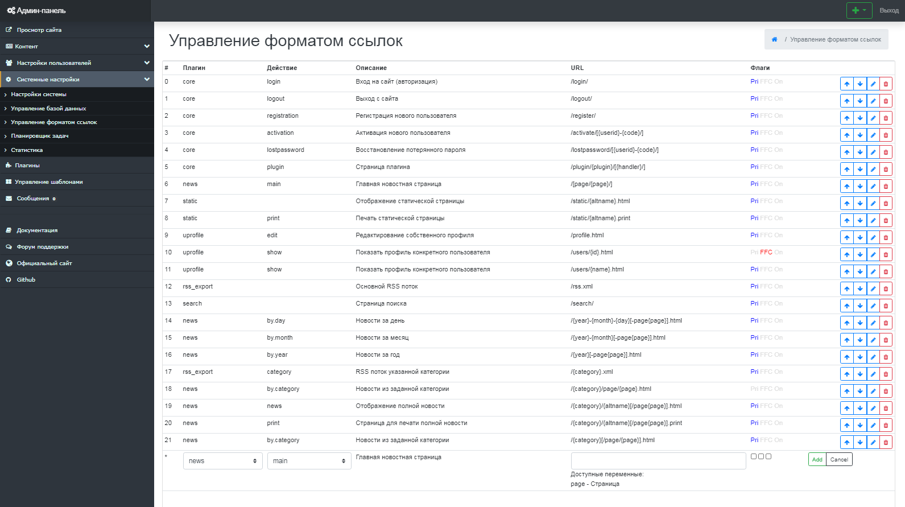

Управление форматом ссылок
==========================

Next Generation CMS позволяет гибко настроить формат URL для определённых групп тиопвых страниц.
 Система предусматривает специальные флаги, которые регулируют вопросы отображения определённого контента при генерации ссылок. (рис 10.1).

{.img-fluid}
рис 10.1

Используемые флаги
==================

**Pri (Primary action)** - указывает, что по этой строке двиг будет генерировать ссылку
 Данный флаг используется в случае, когда надо сохранить старые ссылки или по какой-то другой причине одна страница должна адресоваться с разных URL'ов.
 (для одного плагина:действия может быть несколько строк в настройках ЧПУ, но только одну из строк двиг использует для генерации ссылок - ту, которая отмечена флагом Pri).
 Остальные строки с тем же плагином:действием будут расцениваться просто как альтернативные ссылки по которым можно обращаться.

**FFC (Flag: Fail Continue)** - специальный флаг, который позволяет одну и ту же ссылку назначать разным действиям.
 Основное условие - действие должно поддерживать этот флаг (сейчас его поддерживают только новости и статические страницы).
 Без флага в новостях/статиках идёт поиск статьи (в соответствии с URL'ом), если статья не найдена - возвращается ошибка "статья не найдена".
 Если флаг включен и статья не находится, то управление возвращается обратно в парсер ЧПУ и он начинает искать совпадения со следующей строки.

**On (Off)** - активна ли данная запись (вместо удаления можно просто деактивировать).

Формат - символы "[" и "]" используются для пометки условного (необязательного) блока, может быть только один в URL'е.
 Используется для работы с переменными, которые не всегда активны (к примеру постраничка - страница \#1 не отображается).
 Всё остальное - как напишешь используя имеющиеся в наличии переменные (отображаются при редактировании).

Основной момент о котором многие не думают: новая система ЧПУ - очень простая система.
 Работает по принципу: взяли первую строчку, проверили подходит ли она под регулярное выражение (формируемое из указанной в настройках ссылки).
 Если подходит - передаём управление соответствующему плагину. если не подходит - берём следующую строчку и так до конца таблицы.
 Если в конце таблицы так ни одного соответствия и не нашли, то выводим ошибку "страница не найдена".
 И всё. Ничего другого движок ЧПУ не умел, не умеет,... да и не надо ему в принципе ничего другого уметь.

Поэтому крайне важно соблюдать правильный порядок следования строк в таблице ЧПУ.

© 2008-2020 Next Generation CMS
