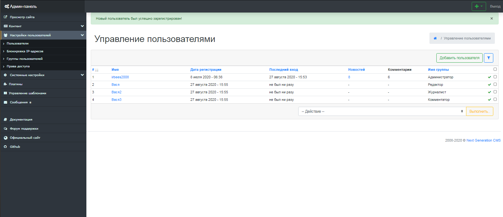
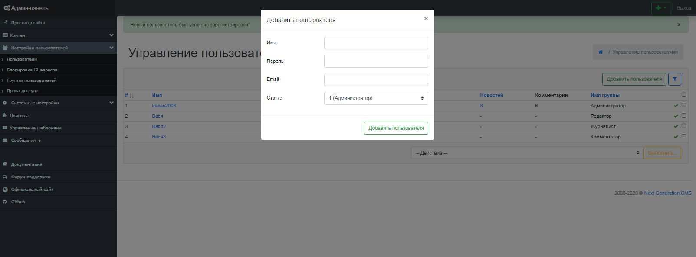

Работа с пользователями
=======================

В Next Generation CMS существует возможность регистрации неограниченного количества пользователей и наделения их какими-либо правами.
 Каждый пользователь должен иметь минимум 2 свойства:
 Логин и пароль, при помощи которых происходит авторизация в системе, а также должен быть отнесен к какой-нибудь группе пользователей.
 На странице списка пользователей вы можете увидеть всех пользователей системы.
 Редактирование пользователя и смена его статуса осуществляется по гиперссылке - при выборе определенного пользователя. (рис 6.1).

{.img-fluid}
рис 6.1

Регистрация пользователя
========================

Для регистрации нового пользователя выберете вкладку "Добавить пользователя" и заполните форму (рис 6.2).

{.img-fluid}
рис 6.2

Система разграничения прав пользователя
=======================================

Каждый пользователь может быть наделен различными правами доступа:
 [1] - Администратор: может всё
 [2] - Редактор: управление категориями, редактирование комментов, бан по IP + [3] + [4]
 [3] - Журналист: добавление и редактирование своих новостей, загрузка файлов, картинок
 [4] - Комментатор: просто авторизованный пользователь сайта, его даже в админку не пустит

© 2008-2020 Next Generation CMS
